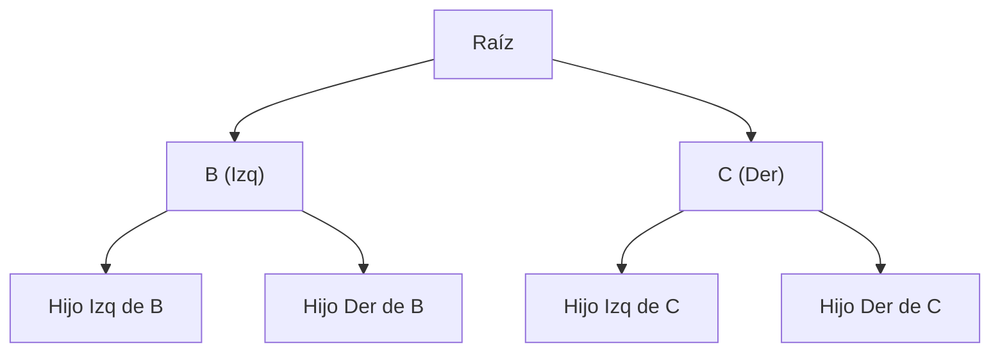
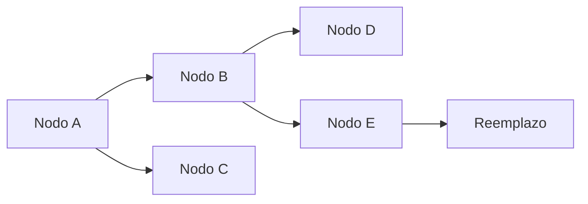
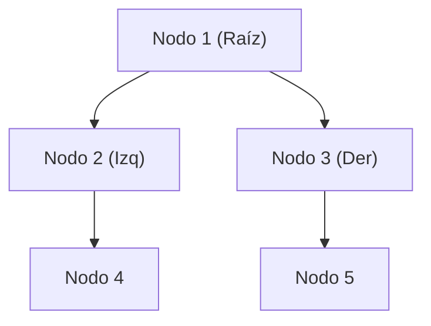
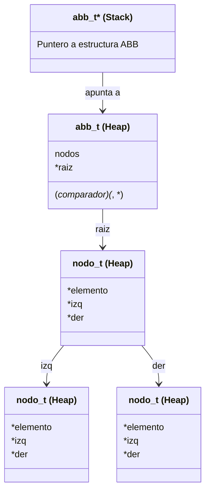
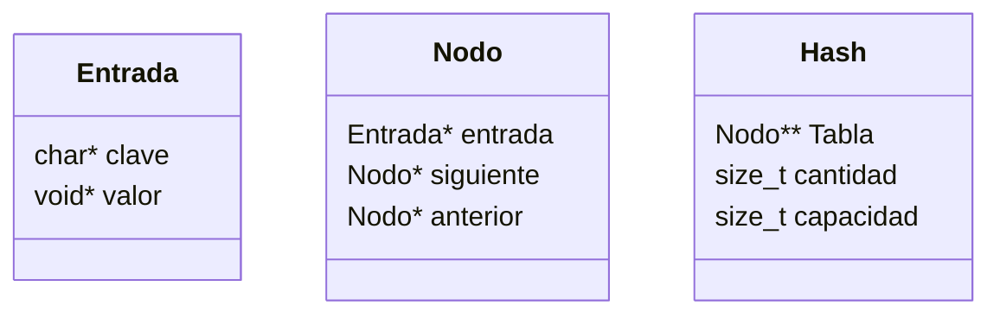
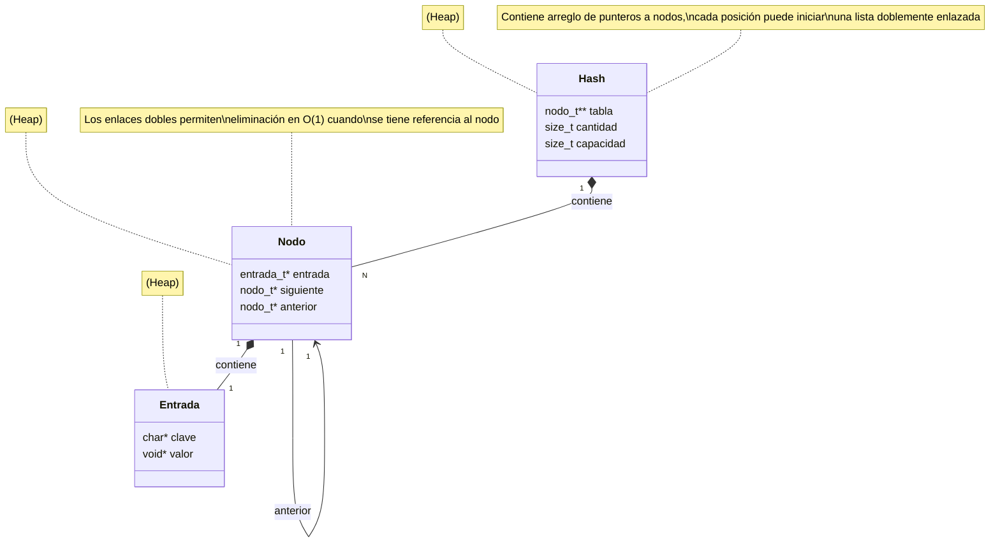
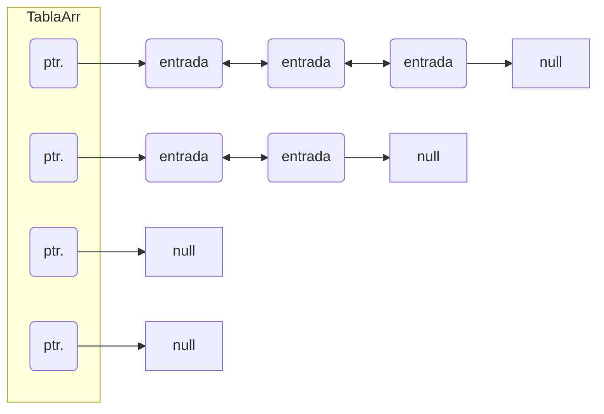
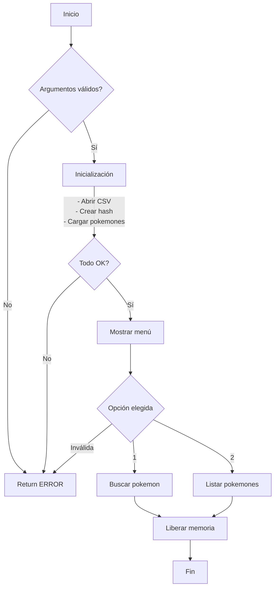

# ADT C

- Go to [LIST](#tda-lista)

- Go to [BST](#tda-abb)

- Go to [HASH](#tda-hash)

## TDA LISTA

- Para compilar:

```bash
make build-tp
```

- Para ejecutar:

```bash
./tp_lista pokedex.csv
```

- Para ejecutar con valgrind:
```bash
valgrind ./tp_lista pokedex.csv
```

---

##  Funcionamiento

### Estructura de datos más importante: `Lista`
La estructura de datos más importante en este TP es la lista. Se implementa como una lista simplemente enlazada, donde cada nodo contiene un puntero al siguiente nodo y un puntero a los datos que almacena. La lista tiene un puntero al frente y un puntero al fondo, lo que permite un acceso rápido a ambos extremos. Las operaciones básicas que se pueden realizar sobre una lista son: insertar, eliminar, obtener, buscar y recorrer.

### Estructura de datos: `Pila`
La pila se implementa como una lista simplemente enlazada. La pila tiene un puntero al frente, que es el tope de la pila. Las operaciones básicas que se pueden realizar sobre una pila son: apilar, desapilar, obtener el tope y verificar si está vacía.

### Estructura de datos: `Cola`
La cola se implementa como una lista simplemente enlazada. La cola tiene un puntero al frente y un puntero al fondo. Las operaciones básicas que se pueden realizar sobre una cola son: encolar, desencolar, obtener el frente y verificar si está vacía.

### Estructura de datos: `Iterador`
El iterador de la lista es una estructura que permite recorrer los elementos de la lista de manera secuencial. Su funcionamiento se basa en mantener un puntero al nodo actual de la lista, permitiendo avanzar al siguiente nodo y obtener el elemento actual.

El iterador se crea llamando a la función `lista_iterador_crear`, la cual devuelve un puntero al iterador creado. El iterador se inicializa con el nodo frente de la lista.

La función `lista_iterador_hay_siguiente` devuelve un booleano indicando si hay un nodo siguiente en la lista. La función `lista_iterador_avanzar` avanza el iterador al siguiente nodo de la lista. La función `lista_iterador_obtener_elemento_actual` devuelve el elemento actual del nodo al que apunta el iterador.

El iterador se destruye llamando a la función `lista_iterador_destruir`, la cual libera la memoria asignada al iterador.


## FLUJO DE EJECUCIÓN
El flujo de ejecución del programa `tp_lista.c` es el siguiente:

1. El programa comienza abriendo el archivo pasado como parámetro y leyéndolo línea por línea.
2. Por cada línea, crea un registro e intenta agregarlo a la lista.
3. La función de lectura intenta leer todo el archivo o hasta encontrar el primer error.
4. Devuelve una lista con todos los registros creados.
5. Luego, el programa permite al usuario elegir entre buscar un Pokémon o listar todos los Pokémon.
6. Si elige buscar un Pokémon, se llama a la función `buscar_pokemon`.
7. Si elige listar todos los Pokémon, se llama a la función `lista_iterar_elementos` para imprimir todos los Pokémon.
8. Finalmente, el programa destruye la lista y libera la memoria asignada a los Pokémon.

### Funcion de anadir a lista

La función `lista_agregar_elemento` es una de las funciones más importantes de la implementación. Permite insertar un elemento en la lista en la posición dada. Si la posición es mayor a la cantidad de elementos, la función devuelve false. La función recibe como parámetros la lista, la posición y el elemento a insertar. La función devuelve true si pudo insertar el elemento o false en caso de error. La implementación de esta función es crucial para la funcionalidad de la lista, ya que permite la inserción de nuevos elementos de manera dinámica.

La función `lista_agregar_al_final` es una función que permite insertar un elemento al final de la lista mejorando la complejidad temporal en esto. Esta función en reemplazo a `lista_agregar_elemento` cuando la posición dada es igual a la cantidad de elementos en la lista. Es importante para poder tener O(1) para la inserción al final de la lista que es una operación muy común.

La función `lista_quitar_elemento` es otra función importante de la implementación. Permite eliminar un elemento de la lista en la posición dada. Si la posición es mayor a la cantidad de elementos, la función devuelve false. La función recibe como parámetros la lista, la posición y un puntero a la variable donde se almacenará el elemento eliminado. La función devuelve true si pudo eliminar el elemento o false en caso de error. La implementación de esta función es crucial para la funcionalidad de la lista, ya que permite la eliminación de elementos de manera dinámica. Además, tiene una implementación especial que internamente es capaz de ser O(1) para operación pop en la pila y desencolar en la cola.

Ejemplo de una de estas funciones:
```c
bool lista_quitar_elemento(Lista *lista, size_t idx, void **removido)
{
	if (!lista || idx >= lista->cantidad)
		return false;

	if (idx == 0) {
		return remover_frente(lista, removido);
	} else if (idx == lista->cantidad - 1) {
		return remover_fondo(lista, removido);
	} else {
		return remover_mitad(lista, idx, removido);
	}
}
```

---
## Respuestas a las preguntas teóricas

### Estructuras
<div align="center">
  
</div>

### Que es una pila?
Una pila es un Tipo de Dato Abstracto (TDA) que permite almacenar y recuperar datos siguiendo el principio de LIFO (Last In, First Out).
Es decir, el último elemento que se inserta en la pila es el primero en ser eliminado.
Las operaciones básicas que se pueden realizar sobre una pila son:
- **Apilar**: Inserta un elemento al final de la pila.
- **Desapilar**: Elimina el ultimo elemento en la pila.
- **Top**: Devuelve el último elemento insertado en la pila.

<div align="center">
  
</div>
<div align="center">
  
</div>

### Que es una cola?
Una cola es un Tipo de Dato Abstracto (TDA) que permite almacenar y recuperar datos siguiendo el principio de FIFO (First in, First Out).
Es decir, el primer elemento que se inserta en la cola es el primero en ser elimininado.
Las operacioens basicas que se pueden realizar sobre una cola son:
- **Encolar**: Inserta un elemento al final de la cola.
- **Desencolar**: Elimina el primer elemento en la cola.
- **Frente**: Devuelve el primer elemento de la cola.

<div align="center">
  
</div>
<div align="center">
  
</div>

### Que es una lista?
Una lista es un tipo de dato abstracto (TDA) que permite almacenar y recuperar datos ordenados, es decir, cada elemento de la lista tiene un orden específico.
Las operaciones básicas que se pueden realizar sobre una lista son:
- **Insertar**: Agrega un elemento en una posición específica de la lista.
- **Eliminar**: Elimina un elemento de la lista.
- **Obtener**: Devuelve el elemento en una posición específica de la lista.
- **Buscar**: Busca un elemento en la lista.
- **Recorrer**: Recorre todos los elementos de la lista.

<div align="center">
  
</div>
<div align="center">
  
</div>
<div align="center">
  
</div>

### Diferencias de complejidad entre las implementaciones de lista simplemente enlazada, doblemente enlazada y vector dinámico
- **Insertar/obtener/eliminar al inicio**:
  - **Lista simplemente enlazada**: Insertar al inicio es O(1), obtener al inicio es O(1) y eliminar al inicio es O(1).
  - **Lista doblemente enlazada**: Insertar al inicio es O(1), obtener al inicio es O(1) y eliminar al inicio es O(1).
  - **Vector dinámico**: Insertar al inicio es O(n), obtener al inicio es O(1) y eliminar al inicio es O(n).
- **Insertar/obtener/eliminar al final**:
  - **Lista simplemente enlazada**: Insertar al final es O(n), obtener al final es O(n) y eliminar al final es O(n) o serian / O(1) con puntero al fondo.
  - **Lista doblemente enlazada**: Insertar al final es O(1), obtener al final es O(1) y eliminar al final es O(1).
  - **Vector dinámico**: Insertar al final es O(1) amortizado, obtener al final es O(1) y eliminar al final es O(1).
- **Insertar/obtener/eliminar al medio**:
  - **Lista simplemente enlazada**: Insertar al medio es O(n), obtener al medio es O(n) y eliminar al medio es O(n).
  - **Lista doblemente enlazada**: Insertar al medio es O(n), obtener al medio es O(n) y eliminar al medio es O(n).
  - **Vector dinámico**: Insertar al medio es O(n), obtener al medio es O(1) y eliminar al medio es O(n).

### Complejidad de las operaciones implementadas en tu trabajo para la pila y la cola
- **Pila**:
  - **Crear**: O(1).
  - **Apilar**: O(1).
  - **Desapilar**: O(1).
  - **Tope**: O(1).
  - **Esta vacía**: O(1).
  - **Cantidad**: O(1).
  - **Destruir**: O(n).
  - **Destruir todo**: O(n * f(n)).

- **Cola**:
  - **Crear**: O(1).
  - **Encolar**: O(1).
  - **Desencolar**: O(1).
  - **Frente**: O(1).
  - **Esta vacía**: O(1).
  - **Cantidad**: O(1).
  - **Destruir**: O(n).
  - **Destruir todo**: O(n * f(n)).

## TDA ABB (Árbol Binario de Búsqueda)

### Para compilar:

```bash
make tp
```

### Para ejecutar:

```bash
make run
```

### Para ejecutar con valgrind:

```bash
make run-valgrind
```

---

## Funcionamiento

El Árbol Binario de Búsqueda (ABB) es una estructura de datos que permite almacenar elementos de forma ordenada. Cada nodo tiene un máximo de dos hijos: el izquierdo, que contiene elementos menores, y el derecho, con elementos mayores.

Se implementaron las siguientes operaciones sobre el ABB:

1. **Inserción (`abb_insertar`)**: Inserta un nuevo elemento en el árbol, respetando el orden definido por el comparador.
2. **Eliminación (`abb_quitar`)**: Elimina un elemento del árbol. Si el nodo tiene dos hijos, se reemplaza con su predecesor inorden.
3. **Búsqueda (`abb_obtener`)**: Encuentra y devuelve un elemento.
4. **Recorridos (`abb_iterar_inorden`, `abb_iterar_preorden`, `abb_iterar_postorden`)**: Recorren el ABB en los distintos órdenes.
5. **Destrucción (`abb_destruir` y `abb_destruir_todo`)**: Libera la memoria asociada al árbol y sus elementos si es necesario.

Se tomaron decisiones para garantizar eficiencia y evitar pérdida de memoria, por ejemplo, asegurando que `realloc` no cause pérdida de datos si falla, usando calloc para inicializar memoria en 0 y usando destructores personalizados para liberar memoria.

A continuación, se muestra un esquema básico de una posible configuracion del ABB:



---

## Ejemplo de Código

El siguiente fragmento muestra cómo se implementó la función de inserción en el ABB (usando recursion y wrapper):

```c
bool abb_insertar(abb_t *abb, void* elemento) {
    if (abb == NULL || elemento == NULL)
        return false;

    size_t nodos_iniciales = abb->nodos;
    abb->raiz = nodo_insertar(abb, abb->raiz, elemento);

    return abb->nodos > nodos_iniciales;
}
```

En caso de eliminación, si el nodo tiene dos hijos, el árbol reemplaza el nodo con su predecesor inorden:



---

## Respuestas a las preguntas teóricas
### Conceptos Básicos

#### 1. ¿Qué es un árbol?

Un **árbol** es una estructura de datos jerárquica que se compone de **nodos** conectados. El árbol tiene un nodo especial llamado **raíz**, que es el primer nodo con el que se empiezan a hacer conexiones con los **hijos** (otros nodos). Cada nodo puede tener múltiples hijos, pero sólo tiene un único padre (exceptuando la raiz que es la excepciòn a esta regla).

#### Propiedades de un Árbol:
- **Raíz**: Nodo principal.
- **Hojas**: Nodos que no tienen hijos.
- **Altura**: Número de aristas desde la raíz hasta el nodo más profundo.
- **Nivel**: Distancia de un nodo a la raíz.
- **Subárbol**: Cualquier nodo y todos sus descendientes.

#### Diagrama de un Árbol:
```
.      1 (Raíz)
      /  \
     2    3
    /    / \
   4    5   6
```

#### 2. ¿Qué es un Árbol Binario?

Un **árbol binario** es un tipo de árbol en el que cada nodo tiene como máximo **dos hijos**, usualmente con los nombres de **hijo izquierdo** e **hijo derecho**. Un árbol binario no impone ninguna restricción particular en los valores almacenados en los nodos usualmente, por lo que se les considerarian genericos.

#### Operaciones Básicas de un Árbol Binario:
- **Inserción**: Añadir un nodo en una posición especìfica.
- **Búsqueda**: Buscar un valor específico en el árbol.
- **Recorridos**: Preorden, inorden, postorden, para visitar todos los nodos del árbol.

#### Complejidad de Operaciones:
- **Inserción**: O(n) para mayoria de los casos.
- **Búsqueda**: O(n) para mayoria de los casos.
- **Recorridos**: O(n) para mayoria de los casos.

#### Diagrama de un Árbol Binario:
```
.      1
      / \
     2   3
    / \
   4   5
```

#### 3. ¿Qué es un Árbol Binario de Búsqueda (ABB)?

Un **árbol binario de búsqueda (ABB)** es un árbol binario con una propiedad especial: **cada nodo del subárbol izquierdo** contiene un valor **menor** que el nodo actual, y **cada nodo del subárbol derecho** contiene un valor **mayor** que el nodo actual.

#### Importancia del ABB:
Esta propiedad del ABB permite realizar búsquedas, inserciones y eliminaciones de manera eficiente, logrando una complejidad logarítmica en la mayoría de los casos, siempre cuando haya habido una inserciòn adecuado o se haya mantenido el arbol balanceado.

#### Diagrama de un ABB:
```
.      8
      / \
     3   10
    / \    \
   1   6    14
      / \   /
     4   7 13
```
En este ejemplo:
- El nodo con valor 8 tiene un subárbol izquierdo con valores menores que 8 (1, 3, 6, 4, 7).
- El subárbol derecho tiene valores mayores que 8 (10, 14, 13).

### Operaciones Básicas del ABB

1. **Inserción**: Se compara el valor a insertar con el nodo actual. Si es menor, se mueve al subárbol izquierdo; si es mayor, al derecho, y se continúa hasta encontrar una posición vacía.

   - **Mejor caso**: O(log n), cuando el árbol está balanceado.
   - **Peor caso**: O(n), cuando el árbol está degenerado (similar a una lista enlazada).

2. **Búsqueda**: Similar a la inserción. Se compara el valor buscado con el nodo actual y se mueve a la izquierda o derecha, dependiendo de si el valor es menor o mayor.

   - **Mejor caso**: O(log n).
   - **Peor caso**: O(n).

3. **Eliminación**: Se debe considerar tres casos:
   - El nodo a eliminar es una hoja (sin hijos).
   - El nodo a eliminar tiene un solo hijo.
   - El nodo a eliminar tiene dos hijos (en este caso, se reemplaza por el sucesor inorden, el valor mínimo del subárbol derecho o el máximo del subárbol izquierdo).

   - **Mejor caso**: O(log n).
   - **Peor caso**: O(n).

#### Diagrama de Eliminación:
Si eliminamos el nodo con valor 10 del árbol:
```
.      8
      /  \
     3    14
    / \   /
   1   6  13
      / \
     4   7
```

### Importancia de la Estructura y el Balanceo

Un árbol binario de búsqueda es útil para manejar datos de manera eficiente, pero si el árbol se desbalancea, sus ventajas desaparecen, ya que su complejidad puede degenerarse a O(n). Para evitar esto, se utilizan estructuras como los **árboles balanceados** (AVL o Red-Black trees), que garantizan que la altura del árbol se mantenga en log(n) y que el ABB no se degenere en lista, asegurando tiempos óptimos para operaciones/primitivas comunes.

En resumen:
- **Árbol**: Una estructura básica con conexiones jerárquicas.
- **Árbol Binario**: Un árbol con a lo sumo dos hijos por nodo.
- **ABB**: Un árbol binario que garantiza que los nodos en la izquierda son menores y los de la derecha son mayores, mejorando la eficiencia en búsquedas e inserciones.

#### Diagrama de Memoria

El siguiente es un ejemplo de cómo se almacenan los nodos del ABB en memoria:



### Decisiones de diseño

1. **Uso de funciones recursivas**: La mayor parte de las operaciones del ABB (inserción, eliminación, búsqueda) se implementaron de forma recursiva para simplificar el manejo de los punteros de cada nodo, para mayor facilidad y legibilidad tambien se usaron funciones wrapper.

2. **Manejo de memoria**: Se empleó un destructor para liberar correctamente los elementos almacenados en el **ABB** cuando se destruye la estructura, dando opciones para liberar de forma simple o liberar tambien los elementos dando una funcion destructora, ya que el **ABB** no conoce el tipo de los elementos, es completamente agnostico a lo que guarda el usuario del **TDA**.

3. **Funcion Quitar**: Esta funcion fue de lejos la mas compleja de implementar, ya que se deben considerar 3 casos, el nodo a eliminar es una hoja, el nodo a eliminar tiene un solo hijo y el nodo a eliminar tiene dos hijos, en este ultimo caso se debe reemplazar el nodo a eliminar por el predecesor inorden.
Fue necesario implementar funciones auxiliares para algunos de los casos, como la funcion **nodo_quitar_hoja**, etc. Además, de crear una funcion auxiliar para encontrar el predecesor inorden.

---

## Diagrama de memoria detallado



En este diagrama se visualizan las relaciones entre nodos en el **ABB**, donde cada nodo apunta a sus hijos izquierdos y derechos.

---

## Conclusión

Este trabajo implementa un TDA Árbol Binario de Búsqueda eficiente y flexible, capaz de almacenar cualquier tipo de datos genéricos mediante el uso de un comparador. Se priorizó la claridad y eficiencia, asegurando una buena gestión de memoria y operaciones de tiempo logarítmico en la mayoría de los casos.


## TDA HASH

- Para compilar:

```bash
make build
```

- Para ejecutar:

```bash
make run
```

- Para ejecutar con valgrind:
```bash
make valgrind-run
```
---
##  Funcionamiento

El TP Hash es un tipo de diccionario implementado con una tabla de Hash, para poder lograr una complejidad de búsqueda constante.
Para poder resolver las colisiones, se usa una tabla que guarda el primero de diferentes nodos enlazados, estos vienen conectados y se usan para la búsqueda eficiente.

#### Diagramas de estructuras


#### Diagramas relación estructuras


#### Funcionamiento de tabla hash

### Por ejemplo:

El programa funciona abriendo el archivo pasado como parámetro y leyéndolo línea por línea. Por cada línea crea un registro e intenta agregarlo al vector. La función de lectura intenta leer todo el archivo o hasta encontrar el primer error. Devuelve un vector con todos los registros creados.




### Estructura del Programa

El programa está dividido en varios archivos, cada uno con responsabilidades específicas:

1. **tp_hash.c**: Contiene la función principal (`main`) y la lógica de interacción con el usuario.
2. **csv.c y csv.h**: Manejan la lectura de archivos CSV.
3. **hash.c y hash.h**: Implementan la tabla hash.
4. **pokemon.c y pokemon.h**: Definen las operaciones relacionadas con los Pokémon.
5. **str_split.c y str_split.h**: Proveen funciones para dividir cadenas.
6. **hash_utils.c y hash_utils.h**: Contienen funciones auxiliares para la tabla de hash.
7. **io_utils.c y io_utils.h**: Contienen funciones de utilidad para leer diferentes tipos de datos.

### Funcionamiento del Programa

#### 1. Función Principal Programa (`tp_hash.c`)

La función `main` en `tp_hash.c` es el punto de entrada del programa. Su flujo es el siguiente:

1. **Verificación de Argumentos**: Verifica que se haya pasado un archivo CSV como argumento.
2. **Apertura del Archivo CSV**: Utiliza `abrir_archivo_csv` para abrir el archivo CSV.
3. **Creación de la Tabla Hash**: Crea una tabla hash con una capacidad inicial de 20.
4. **Carga de Pokémon**: Llama a `agregar_pokemones` para leer los Pokémon del archivo CSV y agregarlos a la tabla hash.
5. **Interacción con el Usuario**: Muestra un menú para que el usuario elija entre buscar un Pokémon o listar todos los Pokémon.
6. **Ejecución de la Opción del Usuario**: Dependiendo de la opción elegida, llama a `buscar_pokemon` o `hash_iterar` para listar los Pokémon.
7. **Liberación de Recursos**: Destruye la tabla hash y cierra el archivo CSV.

#### 2. Manejo de Archivos CSV (`csv.c` y `csv.h`)

- **abrir_archivo_csv**: Abre un archivo CSV y devuelve un puntero a una estructura `archivo_csv`.
- **leer_linea_csv**: Lee una línea del archivo CSV y la divide en columnas utilizando un separador.
- **cerrar_archivo_csv**: Cierra el archivo CSV y libera la memoria asociada.

#### 3. Implementación de la Tabla Hash (`hash.c` y `hash.h`)

- **hash_crear**: Crea una tabla hash con una capacidad inicial.
- **hash_insertar**: Inserta un elemento en la tabla hash.
- **hash_buscar**: Busca un elemento en la tabla hash.
- **hash_quitar**: Elimina un elemento de la tabla hash.
- **hash_iterar**: Itera sobre todos los elementos de la tabla hash y aplica una función a cada uno.
- **hash_destruir** y **hash_destruir_todo**: Destruyen la tabla hash y liberan la memoria.

#### 4. Operaciones con Pokémon (`pokemon.c` y `pokemon.h`)

- **leer_pokemon**: Lee un Pokémon del archivo CSV.
- **agregar_pokemones**: Agrega todos los Pokémon del archivo CSV a la tabla hash.
- **liberar_pokemon**: Libera la memoria asociada a un Pokémon.
- **print_pokemon**: Imprime la información de un Pokémon.
- **buscar_pokemon**: Busca un Pokémon en la tabla hash por su nombre.

#### 5. División de Cadenas (`str_split.c` y `str_split.h`)

- **dividir_string**: Divide una cadena en partes utilizando un separador.
- **liberar_partes**: Libera la memoria asociada a las partes de una cadena dividida.

#### 6. Tipos y Funciones Auxiliares (`hash_utils.c` y `hash_utils.h`)

- **hasher**: Función de hash para calcular el índice de una clave en la tabla hash.
- **nodo_crear**: Crea una estructura nodo_t*
- **nodo_destruir**: Destruye el nodo, la entrada y la clave
- **encontrar_entrada**: Encuentra el nodo basado en la clave
- **agregar_entrada**: Agrega un nodo entrada directamente a la tabla hash
- **hash_rehash**: Rehash para aumentar la capacidad

#### 7. Funciones de Utilidad IO(`io_utils.c` y `io_utils.h`)

- **read_int**: Lee un entero de una cadena.
- **read_string**: Lee una cadena y la copia en un nuevo espacio de memoria.
- **read_char**: Lee un carácter de una cadena.

### Ejecución del Programa

El programa mostrará un menú para que el usuario elija entre buscar un Pokémon o listar todos los Pokémon. Dependiendo de la opción elegida, el programa realizará la acción correspondiente y mostrará los resultados en la consola.

### Conclusión

El programa `tp_hash` es una aplicación completa que utiliza una tabla hash para gestionar una base de datos de Pokémon. La estructura modular del código facilita su mantenimiento y expansión. Cada componente tiene una responsabilidad clara, lo que permite una fácil comprensión y modificación del código, estando dividida en diferentes archivos con para cada responsabilidad.

Una de las funciones más importantes en esta implementación de hash es la de `rehash` ya que es la que garantiza que el `hashmap` se pueda usar con cualquier número de pares clave-valor. Toma todas las entradas que hay en la tabla, las añade a una nueva y luego elimina la vieja. Esto garantiza la integridad de los índices dados por el hash y el correcto funcionamiento de la búsqueda de los valores por cada clave.

```c
static bool hash_rehash(hash_t *hash)
{
	hash->cap *= 2;
	nodo_t **tabla_vieja = hash->tabla;
	nodo_t **tabla = calloc(hash->cap, sizeof(nodo_t *));
	if (!tabla)
		return false;
	hash->tabla = tabla;
	hash->size = 0;
	for (size_t i = 0; i < hash->cap / 2; i++) {
		nodo_t *nodo = tabla_vieja[i];
		while (nodo) {
			nodo_t *siguiente = nodo->sig;
			if (!agregar_entrada(hash, nodo->entrada->clave,
					     nodo->entrada->valor))
				return false;
			free(nodo->entrada);
			free(nodo);
			nodo = siguiente;
			hash->size++;
		}
	}
	free(tabla_vieja);
	return true;
}
```

---

## Respuestas a las preguntas teóricas

### Qué es un diccionario
Un diccionario es un tipo de dato abstracto que permite almacenar pares de clave-valor. Su principal funcionalidad es la de asociar un valor a una clave específica y permitir la recuperación del valor correspondiente a una clave dada, lo que seria una relacion asimetrica entre esta clave y el valor. Las operaciones mas caracteristicas de los diccionarios son:
- **Insertar**: Añadir un par clave-valor al diccionario.
- **Buscar**: Recuperar el valor asociado a una clave específica.
- **Eliminar**: Remover un par clave-valor del diccionario.

### Formas de implementar un diccionario
1. **Hashmap**: Utiliza una función de hash para calcular un índice a partir de la clave, y almacena el valor en la posición correspondiente de una tabla. La función de hash distribuye las claves uniformemente a lo largo de la tabla para minimizar colisiones.
   - **Ventajas**: Búsqueda, inserción y eliminación en tiempo promedio O(1).
   - **Desventajas**: Manejo de colisiones y necesidad de una buena función de hash.

2. **Árbol Binario de Búsqueda (BST)**: Almacena los pares clave-valor en un árbol binario de búsqueda, donde se organizan las claves de forma ordenada en el arbol, estando las menores en el lado izquiera de cada nodo y las mayores en el lado derecho .
   - **Ventajas**: Búsqueda, inserción y eliminación en tiempo O(log n) en promedio.
   - **Desventajas**: Claves deben ser comparables y en árbol desbalanceado, las operaciones pueden ser O(n).

3. **Lista Enlazada**: Almacena los pares clave-valor en una lista enlazada simple.
   - **Ventajas**: Implementación sencilla.
   - **Desventajas**: Búsqueda, inserción y eliminación en tiempo O(n).

### Función de hash
Una función de hash es una función que toma una entrada (o clave) y devuelve un número entero, que se utiliza como índice en una tabla de hash. Las características que debe tener una buena función de hash son:
- **Determinística**: La misma entrada siempre debe producir el mismo resultado.
- **Uniforme**: Debe distribuir las claves uniformemente a lo largo de la tabla para minimizar colisiones.
- **Eficiente**: Deber ser capaz de ser calculada de forma rapida.
- **Minimizar colisiones**: Debe reducir la probabilidad de que dos claves diferentes produzcan el mismo índice.

### Tabla de hash y resolución de colisiones
Una tabla de hash es una estructura de datos que utiliza una función de hash para mapear claves a índices en una tabla. Los métodos de resolución de colisiones incluyen:

1. **Encadenamiento**: Cada posición de la tabla contiene una lista enlazada de todos los pares clave-valor que tienen el mismo índice de hash.
   - **Ventajas**: Maneja bien las colisiones y permite una tabla de tamaño fijo.
   - **Desventajas**: Puede degradarse a O(n) en el peor caso si muchas claves colisionan.

2. **Probing Lineal**: Si una posición está ocupada, se busca la siguiente posición libre en la tabla.
   - **Ventajas**: Simple de implementar.
   - **Desventajas**: Puede causar, quen muchas claves colisionen y se agrupen.

3. **Probing Cuadrático**: Similar al probing lineal, pero la distancia entre las posiciones probadas aumenta cuadráticamente.
   - **Ventajas**: Reduce el clustering comparado con el probing lineal.
   - **Desventajas**: Más complejo de implementar y puede ser menos eficiente en algunos casos.

### Importancia del tamaño de la tabla (Hash abierto y cerrado)
El tamaño de la tabla es crucial para el rendimiento de una tabla de hash. Un tamaño adecuado minimiza las colisiones y mantiene las operaciones de búsqueda, inserción y eliminación eficientes.

- **Hash Abierto (Encadenamiento)**: Aunque las colisiones se manejan mediante listas enlazadas, un tamaño de tabla pequeño puede llevar a listas largas, degradando la complejidad de las operaciones a O(n/k), donde k es el tamaño de la tabla.
- **Hash Cerrado (Probing)**: Un tamaño de tabla pequeño puede llevar a muchas colisiones y clustering, degradando la eficiencia de las operaciones.

### Importancia de la capacidad en un Hash abierto
En una tabla abierta, el tamaño de la tabla sigue siendo importante porque afecta la longitud de las listas enlazadas en cada posición. Si la tabla es demasiado pequeña, las listas se vuelven largas y la complejidad de las operaciones se degrada a O(n/k), donde n es el número de elementos y k es el tamaño de la tabla (asumiendo que cada indice tiene aproximadamente la misma cantidad de elementos por una buena funcion de hash). Por lo tanto, un tamaño adecuado de la tabla es crucial para mantener la eficiencia.

### Dibujos explicativos
#### Tabla de Hash con Encadenamiento
```
Tabla de Hash:
Se inserta A y B en (idx 1) colision
+---+---+---+---+---+
| 0 | 1 | 2 | 3 | 4 |
+---+---+---+---+---+
  |   |   |   |   |
  v   v   v   v   v
 [ ] [A ] [ ] [ ] [ ]
  |   |   |   |   |
  v   v   v   v   v
[ ] [B ] [ ] [ ] [ ]
Se hace el encadenamiento para solucionarlo
```

#### Tabla de Hash con Probing Lineal
```
Tabla de Hash:
Se inserta A (idx 1)
+---+---+---+---+---+
| 0 | 1 | 2 | 3 | 4 |
+---+---+---+---+---+
|   | A |   |   |   |
Se inserta B (idx 1) colision
+---+---+---+---+---+
| 0 | 1 | 2 | 3 | 4 |
+---+---+---+---+---+
|   | A | B |   |   |
Se resuelve buscando un espacio libre

```
