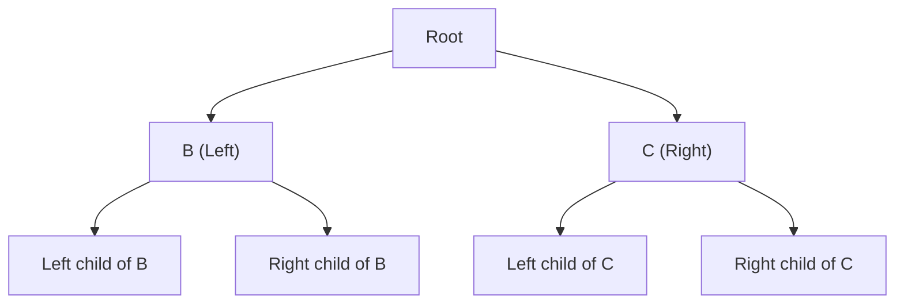
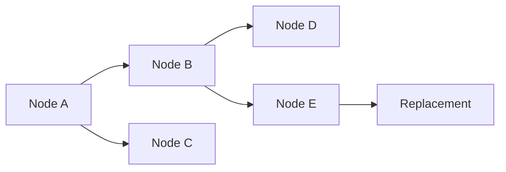
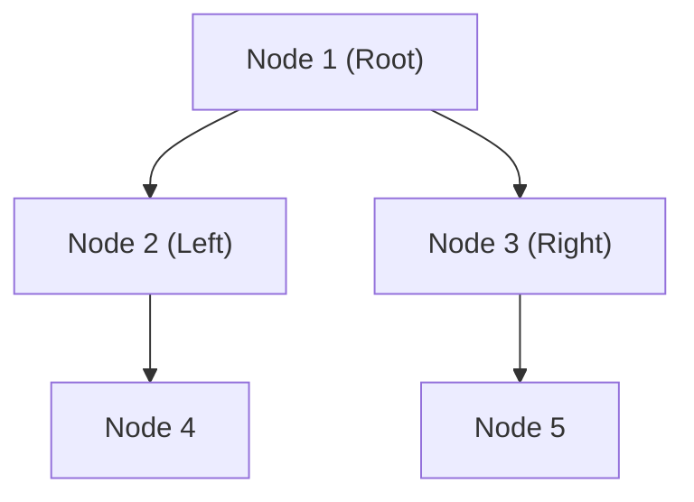
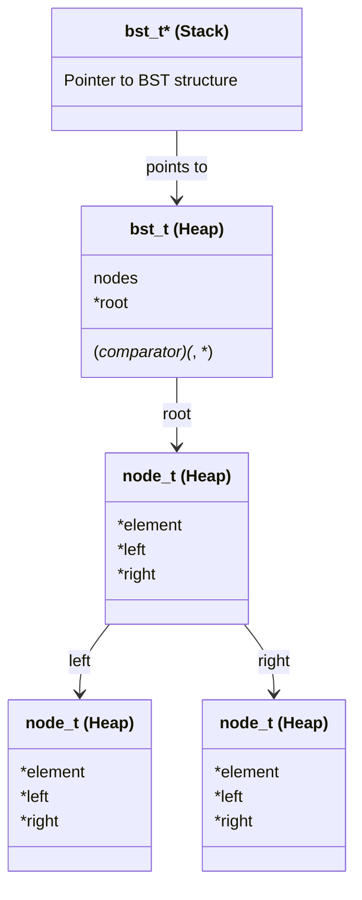
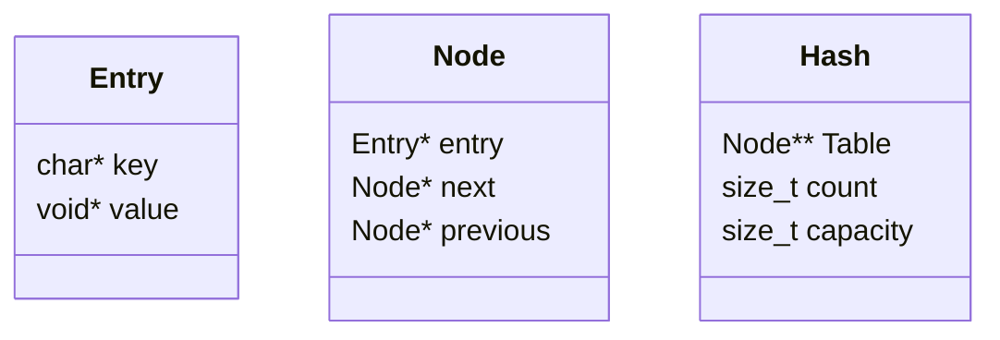
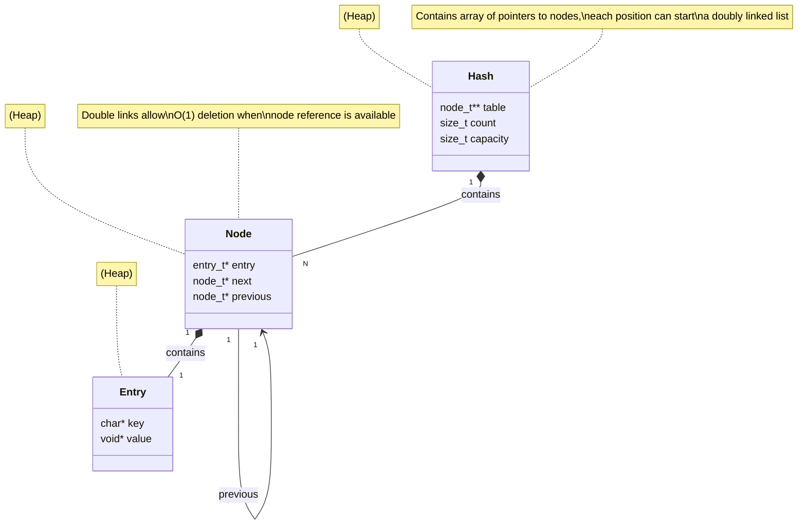
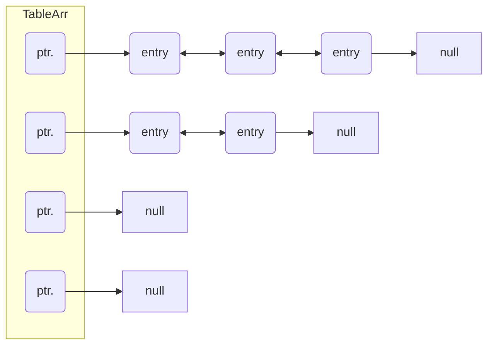
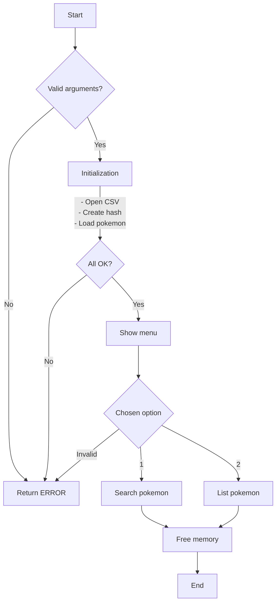

# ADT C

- Go to [LIST](#tda-list)

- Go to [BST](#tda-bst)

- Go to [HASH](#tda-hash)

## TDA LIST

- To compile:

```bash
make build-tp
```

- To run:

```bash
./tp_lista pokedex.csv
```

- To run with valgrind:
```bash
valgrind ./tp_lista pokedex.csv
```

---

## Functionality

### Key Data Structure: `List`
The most important data structure in this project is the list. It is implemented as a singly linked list, where each node contains a pointer to the next node and a pointer to the data it stores. The list has a pointer to the front and a pointer to the back, enabling quick access to both ends. The basic operations that can be performed on a list include: inserting, removing, retrieving, searching, and iterating.

### Data Structure: `Stack`
The stack is implemented as a singly linked list. The stack has a pointer to the front, which represents the top of the stack. The basic operations that can be performed on a stack include: push, pop, retrieve the top, and check if it is empty.

### Data Structure: `Queue`
The queue is implemented as a singly linked list. The queue has a pointer to the front and a pointer to the back. The basic operations that can be performed on a queue include: enqueue, dequeue, retrieve the front, and check if it is empty.

### Data Structure: `Iterator`
The list iterator is a structure that allows sequential traversal of the list elements. It works by maintaining a pointer to the current node of the list, enabling advancement to the next node and retrieval of the current element.

The iterator is created using the `lista_iterador_crear` function, which returns a pointer to the newly created iterator. The iterator is initialized with the front node of the list.

The function `lista_iterador_hay_siguiente` returns a boolean indicating if there is a next node in the list. The function `lista_iterador_avanzar` moves the iterator to the next node in the list. The function `lista_iterador_obtener_elemento_actual` retrieves the element in the current node pointed to by the iterator.

The iterator is destroyed by calling the `lista_iterador_destruir` function, which frees the memory allocated to the iterator.

## PROGRAM FLOW
The execution flow of the `tp_lista.c` program is as follows:

1. The program starts by opening the file passed as a parameter and reading it line by line.
2. For each line, it creates a record and attempts to add it to the list.
3. The reading function tries to read the entire file or until the first error is encountered.
4. It returns a list containing all the created records.
5. Then, the program allows the user to choose between searching for a Pokémon or listing all Pokémon.
6. If the user chooses to search for a Pokémon, the `buscar_pokemon` function is called.
7. If the user chooses to list all Pokémon, the `lista_iterar_elementos` function is used to print all Pokémon.
8. Finally, the program destroys the list and frees the memory allocated to the Pokémon.

### Add to List Function

The `lista_agregar_elemento` function is one of the most important in the implementation. It inserts an element into the list at the specified position. If the position exceeds the number of elements, the function returns false. The function takes the list, the position, and the element to insert as parameters. It returns true if the element was successfully inserted or false if an error occurred. This function is crucial for the list’s functionality as it allows dynamic insertion of new elements.

The `lista_agregar_al_final` function inserts an element at the end of the list, improving time complexity for this operation. It is used instead of `lista_agregar_elemento` when the given position equals the number of elements in the list. This optimization ensures O(1) complexity for adding to the end of the list, a common operation.

The `lista_quitar_elemento` function is another key implementation. It removes an element from the list at the specified position. If the position exceeds the number of elements, the function returns false. The function takes the list, the position, and a pointer to store the removed element as parameters. It returns true if the element was successfully removed or false otherwise. This function supports dynamic removal and includes a special implementation that enables O(1) complexity for stack pop and queue dequeue operations.

Example of one such function:
```c
bool lista_quitar_elemento(Lista *lista, size_t idx, void **removido)
{
	if (!lista || idx >= lista->cantidad)
		return false;

	if (idx == 0) {
		return remover_frente(lista, removido);
	} else if (idx == lista->cantidad - 1) {
		return remover_fondo(lista, removido);
	} else {
		return remover_mitad(lista, idx, removido);
	}
}
```

---

## Theoretical Questions

### Structures
<div align="center">
  
</div>

### What is a Stack?
A stack is an Abstract Data Type (ADT) that stores and retrieves data following the LIFO (Last In, First Out) principle.
The basic operations for a stack are:
- **Push**: Adds an element to the top of the stack.
- **Pop**: Removes the top element of the stack.
- **Top**: Retrieves the top element of the stack.

<div align="center">
  
</div>
<div align="center">
  
</div>

### What is a Queue?
A queue is an Abstract Data Type (ADT) that stores and retrieves data following the FIFO (First In, First Out) principle.
The basic operations for a queue are:
- **Enqueue**: Adds an element to the end of the queue.
- **Dequeue**: Removes the front element of the queue.
- **Front**: Retrieves the front element of the queue.

<div align="center">
  
</div>
<div align="center">
  
</div>

### What is a List?
A list is an Abstract Data Type (ADT) that stores and retrieves ordered data, meaning each element has a specific order.
The basic operations for a list are:
- **Insert**: Adds an element at a specific position.
- **Remove**: Removes an element from the list.
- **Retrieve**: Returns the element at a specific position.
- **Search**: Finds an element in the list.
- **Traverse**: Iterates through all the elements in the list.

<div align="center">
  
</div>
<div align="center">
  
</div>
<div align="center">
  
</div>

### Complexity Differences Among Singly Linked List, Doubly Linked List, and Dynamic Array
- **Insert/retrieve/remove at the beginning**:
  - **Singly Linked List**: O(1).
  - **Doubly Linked List**: O(1).
  - **Dynamic Array**: O(n).
- **Insert/retrieve/remove at the end**:
  - **Singly Linked List**: O(n) or O(1) with a back pointer.
  - **Doubly Linked List**: O(1).
  - **Dynamic Array**: Amortized O(1).
- **Insert/retrieve/remove in the middle**:
  - **Singly Linked List**: O(n).
  - **Doubly Linked List**: O(n).
  - **Dynamic Array**: O(n).

### Complexity of Stack and Queue Operations
- **Stack**:
  - **Create**: O(1).
  - **Push**: O(1).
  - **Pop**: O(1).
  - **Top**: O(1).
  - **Is Empty**: O(1).
  - **Size**: O(1).
  - **Destroy**: O(n).
  - **Destroy All**: O(n * f(n)).

- **Queue**:
  - **Create**: O(1).
  - **Enqueue**: O(1).
  - **Dequeue**: O(1).
  - **Front**: O(1).
  - **Is Empty**: O(1).
  - **Size**: O(1).
  - **Destroy**: O(n).
  - **Destroy All**: O(n * f(n)).

## BST ADT

### To compile:

```bash
make tp
```

### To run:

```bash
make run
```

### To run with valgrind:

```bash
make run-valgrind
```

---

## Operation

The Binary Search Tree (BST) is a data structure that allows storing elements in an ordered way. Each node has a maximum of two children: the left one, containing smaller elements, and the right one, with larger elements.

The following operations were implemented on the BST:

1. **Insertion (`bst_insert`)**: Inserts a new element into the tree, respecting the order defined by the comparator.
2. **Deletion (`bst_remove`)**: Removes an element from the tree. If the node has two children, it's replaced with its in-order predecessor.
3. **Search (`bst_get`)**: Finds and returns an element.
4. **Traversals (`bst_inorder_iterate`, `bst_preorder_iterate`, `bst_postorder_iterate`)**: Traverse the BST in different orders.
5. **Destruction (`bst_destroy` and `bst_destroy_all`)**: Frees memory associated with the tree and its elements if necessary.

Decisions were made to ensure efficiency and prevent memory leaks, for example, ensuring that `realloc` doesn't cause data loss if it fails, using calloc to initialize memory to 0, and using custom destructors to free memory.

Below is a basic diagram of a possible BST configuration:



---

## Code Example

The following fragment shows how the insertion function was implemented in the BST (using recursion and wrapper):

```c
bool bst_insert(bst_t *bst, void* element) {
    if (bst == NULL || element == NULL)
        return false;

    size_t initial_nodes = bst->nodes;
    bst->root = node_insert(bst, bst->root, element);

    return bst->nodes > initial_nodes;
}
```

In case of deletion, if the node has two children, the tree replaces the node with its in-order predecessor:



---

## Answers to theoretical questions
### Basic Concepts

#### 1. What is a tree?

A **tree** is a hierarchical data structure composed of connected **nodes**. The tree has a special node called **root**, which is the first node from which connections start with the **children** (other nodes). Each node can have multiple children, but only has one parent (except for the root which is the exception to this rule).

#### Tree Properties:
- **Root**: Main node.
- **Leaves**: Nodes that have no children.
- **Height**: Number of edges from the root to the deepest node.
- **Level**: Distance from a node to the root.
- **Subtree**: Any node and all its descendants.

#### Tree Diagram:
```
.      1 (Root)
      /  \
     2    3
    /    / \
   4    5   6
```

#### 2. What is a Binary Tree?

A **binary tree** is a type of tree where each node has at most **two children**, usually named **left child** and **right child**. A binary tree doesn't impose any particular restriction on the values stored in the nodes usually, so they would be considered generic.

#### Basic Operations of a Binary Tree:
- **Insertion**: Add a node in a specific position.
- **Search**: Search for a specific value in the tree.
- **Traversals**: Preorder, inorder, postorder, to visit all nodes in the tree.

#### Operation Complexity:
- **Insertion**: O(n) for most cases.
- **Search**: O(n) for most cases.
- **Traversals**: O(n) for most cases.

#### Binary Tree Diagram:
```
.      1
      / \
     2   3
    / \
   4   5
```

#### 3. What is a Binary Search Tree (BST)?

A **binary search tree (BST)** is a binary tree with a special property: **each node in the left subtree** contains a value **less than** the current node, and **each node in the right subtree** contains a value **greater than** the current node.

#### Importance of BST:
This BST property allows for efficient searches, insertions and deletions, achieving logarithmic complexity in most cases, as long as there has been proper insertion or the tree has been kept balanced.

#### BST Diagram:
```
.      8
      / \
     3   10
    / \    \
   1   6    14
      / \   /
     4   7 13
```
In this example:
- The node with value 8 has a left subtree with values less than 8 (1, 3, 6, 4, 7).
- The right subtree has values greater than 8 (10, 14, 13).

### Basic BST Operations

1. **Insertion**: The value to insert is compared with the current node. If it's less, move to the left subtree; if greater, to the right, and continue until finding an empty position.

   - **Best case**: O(log n), when the tree is balanced.
   - **Worst case**: O(n), when the tree is degenerate (similar to a linked list).

2. **Search**: Similar to insertion. Compare the search value with the current node and move left or right, depending on whether the value is less or greater.

   - **Best case**: O(log n).
   - **Worst case**: O(n).

3. **Deletion**: Three cases must be considered:
   - The node to delete is a leaf (no children).
   - The node to delete has one child.
   - The node to delete has two children (in this case, it's replaced by the in-order successor, the minimum value of the right subtree or the maximum value of the left subtree).

   - **Best case**: O(log n).
   - **Worst case**: O(n).

#### Deletion Diagram:
If we delete the node with value 10 from the tree:
```
.      8
      /  \
     3    14
    / \   /
   1   6  13
      / \
     4   7
```

### Importance of Structure and Balance

A binary search tree is useful for handling data efficiently, but if the tree becomes unbalanced, its advantages disappear, as its complexity can degrade to O(n). To avoid this, structures like **balanced trees** (AVL or Red-Black trees) are used, which guarantee that the tree height stays at log(n) and that the BST doesn't degenerate into a list, ensuring optimal times for common operations/primitives.

In summary:
- **Tree**: A basic structure with hierarchical connections.
- **Binary Tree**: A tree with at most two children per node.
- **BST**: A binary tree that guarantees nodes on the left are smaller and nodes on the right are larger, improving efficiency in searches and insertions.

#### Memory Diagram

The following is an example of how BST nodes are stored in memory:



### Design Decisions

1. **Use of recursive functions**: Most BST operations (insertion, deletion, search) were implemented recursively to simplify pointer handling for each node, for greater ease and readability wrapper functions were also used.

2. **Memory management**: A destructor was used to properly free elements stored in the **BST** when destroying the structure, providing options to free simply or also free elements by providing a destructor function, since the **BST** doesn't know the type of elements, it's completely agnostic to what the **ADT** user stores.

3. **Remove Function**: This function was by far the most complex to implement, as 3 cases must be considered: the node to remove is a leaf, the node to remove has one child, and the node to remove has two children, in this last case the node to remove must be replaced by the in-order predecessor.
It was necessary to implement auxiliary functions for some of the cases, like the **node_remove_leaf** function, etc. Additionally, creating an auxiliary function to find the in-order predecessor.

---

## Detailed Memory Diagram



In this diagram, the relationships between nodes in the **BST** are visualized, where each node points to its left and right children.

---

## Conclusion

This work implements an efficient and flexible BST ADT, capable of storing any type of generic data through the use of a comparator. Clarity and efficiency were prioritized, ensuring good memory management and logarithmic time operations in most cases.

## TDA HASH

- To compile:

```bash
make build
```

- To run:

```bash
make run
```

- To run with valgrind:
```bash
make valgrind-run
```
---
## Operation

The Hash TP is a dictionary type implemented with a Hash table to achieve constant search complexity.
To resolve collisions, it uses a table that stores the first of different linked nodes, which are connected and used for efficient searching.

#### Structure Diagrams


#### Structure Relationship Diagrams


#### Hash Table Operation

### For example:

The program works by opening the file passed as a parameter and reading it line by line. For each line, it creates a record and tries to add it to the vector. The reading function attempts to read the entire file or until it finds the first error. It returns a vector with all created records.



### Program Structure

The program is divided into several files, each with specific responsibilities:

1. **tp_hash.c**: Contains the main function and user interaction logic.
2. **csv.c and csv.h**: Handle CSV file reading.
3. **hash.c and hash.h**: Implement the hash table.
4. **pokemon.c and pokemon.h**: Define Pokemon-related operations.
5. **str_split.c and str_split.h**: Provide string splitting functions.
6. **hash_utils.c and hash_utils.h**: Contain auxiliary functions for the hash table.
7. **io_utils.c and io_utils.h**: Contain utility functions for reading different data types.

### Program Operation

#### 1. Main Program Function (`tp_hash.c`)

The `main` function in `tp_hash.c` is the program's entry point. Its flow is as follows:

1. **Argument Verification**: Verifies that a CSV file was passed as an argument.
2. **CSV File Opening**: Uses `open_csv_file` to open the CSV file.
3. **Hash Table Creation**: Creates a hash table with an initial capacity of 20.
4. **Pokemon Loading**: Calls `add_pokemon` to read Pokemon from the CSV file and add them to the hash table.
5. **User Interaction**: Shows a menu for the user to choose between searching for a Pokemon or listing all Pokemon.
6. **User Option Execution**: Depending on the chosen option, calls `search_pokemon` or `hash_iterate` to list Pokemon.
7. **Resource Release**: Destroys the hash table and closes the CSV file.

#### 2. CSV File Handling (`csv.c` and `csv.h`)

- **open_csv_file**: Opens a CSV file and returns a pointer to a `csv_file` structure.
- **read_csv_line**: Reads a line from the CSV file and splits it into columns using a separator.
- **close_csv_file**: Closes the CSV file and frees associated memory.

#### 3. Hash Table Implementation (`hash.c` and `hash.h`)

- **hash_create**: Creates a hash table with initial capacity.
- **hash_insert**: Inserts an element into the hash table.
- **hash_search**: Searches for an element in the hash table.
- **hash_remove**: Removes an element from the hash table.
- **hash_iterate**: Iterates over all elements in the hash table and applies a function to each.
- **hash_destroy** and **hash_destroy_all**: Destroy the hash table and free memory.

#### 4. Pokemon Operations (`pokemon.c` and `pokemon.h`)

- **read_pokemon**: Reads a Pokemon from the CSV file.
- **add_pokemon**: Adds all Pokemon from the CSV file to the hash table.
- **free_pokemon**: Frees memory associated with a Pokemon.
- **print_pokemon**: Prints Pokemon information.
- **search_pokemon**: Searches for a Pokemon in the hash table by name.

#### 5. String Splitting (`str_split.c` and `str_split.h`)

- **split_string**: Splits a string into parts using a separator.
- **free_parts**: Frees memory associated with split string parts.

#### 6. Auxiliary Types and Functions (`hash_utils.c` and `hash_utils.h`)

- **hasher**: Hash function to calculate key index in the hash table.
- **node_create**: Creates a node_t* structure
- **node_destroy**: Destroys the node, entry, and key
- **find_entry**: Finds node based on key
- **add_entry**: Adds entry node directly to hash table
- **hash_rehash**: Rehash to increase capacity

#### 7. IO Utility Functions (`io_utils.c` and `io_utils.h`)

- **read_int**: Reads an integer from a string.
- **read_string**: Reads a string and copies it to new memory space.
- **read_char**: Reads a character from a string.

### Program Execution

The program will display a menu for the user to choose between searching for a Pokemon or listing all Pokemon. Depending on the chosen option, the program will perform the corresponding action and display the results in the console.

### Conclusion

The `tp_hash` program is a complete application that uses a hash table to manage a Pokemon database. The modular structure of the code facilitates its maintenance and expansion. Each component has a clear responsibility, allowing for easy understanding and modification of the code, being divided into different files for each responsibility.

One of the most important functions in this hash implementation is `rehash` as it ensures the `hashmap` can be used with any number of key-value pairs. It takes all entries in the table, adds them to a new one, and then removes the old one. This guarantees the integrity of the indices given by the hash and the correct functioning of value searching by each key.

```c
static bool hash_rehash(hash_t *hash)
{
	hash->cap *= 2;
	nodo_t **old_table = hash->table;
	nodo_t **table = calloc(hash->cap, sizeof(nodo_t *));
	if (!table)
		return false;
	hash->table = table;
	hash->size = 0;
	for (size_t i = 0; i < hash->cap / 2; i++) {
		nodo_t *node = old_table[i];
		while (node) {
			nodo_t *next = node->next;
			if (!add_entry(hash, node->entry->key,
					     node->entry->value))
				return false;
			free(node->entry);
			free(node);
			node = next;
			hash->size++;
		}
	}
	free(old_table);
	return true;
}
```

---

## Answers to Theoretical Questions

### What is a Dictionary
A dictionary is an abstract data type that allows storing key-value pairs. Its main functionality is to associate a value with a specific key and allow retrieval of the value corresponding to a given key, which would be an asymmetric relationship between this key and value. The most characteristic operations of dictionaries are:
- **Insert**: Add a key-value pair to the dictionary.
- **Search**: Retrieve the value associated with a specific key.
- **Delete**: Remove a key-value pair from the dictionary.

### Ways to Implement a Dictionary
1. **Hashmap**: Uses a hash function to calculate an index from the key and stores the value in the corresponding position of a table. The hash function distributes keys uniformly throughout the table to minimize collisions.
   - **Advantages**: Average O(1) search, insertion, and deletion time.
   - **Disadvantages**: Collision handling and need for a good hash function.

2. **Binary Search Tree (BST)**: Stores key-value pairs in a binary search tree, where keys are organized in an ordered manner in the tree, with smaller ones on the left side of each node and larger ones on the right.
   - **Advantages**: Average O(log n) search, insertion, and deletion time.
   - **Disadvantages**: Keys must be comparable and in an unbalanced tree, operations can be O(n).

3. **Linked List**: Stores key-value pairs in a simple linked list.
   - **Advantages**: Simple implementation.
   - **Disadvantages**: O(n) search, insertion, and deletion time.

### Hash Function
A hash function is a function that takes an input (or key) and returns an integer, which is used as an index in a hash table. The characteristics that a good hash function should have are:
- **Deterministic**: The same input should always produce the same result.
- **Uniform**: Should distribute keys uniformly throughout the table to minimize collisions.
- **Efficient**: Should be able to be calculated quickly.
- **Minimize collisions**: Should reduce the probability of two different keys producing the same index.

### Hash Table and Collision Resolution
A hash table is a data structure that uses a hash function to map keys to indices in a table. Collision resolution methods include:

1. **Chaining**: Each table position contains a linked list of all key-value pairs that have the same hash index.
   - **Advantages**: Handles collisions well and allows fixed table size.
   - **Disadvantages**: Can degrade to O(n) in worst case if many keys collide.

2. **Linear Probing**: If a position is occupied, search for the next free position in the table.
   - **Advantages**: Simple to implement.
   - **Disadvantages**: Can cause many keys to collide and cluster.

3. **Quadratic Probing**: Similar to linear probing, but the distance between probed positions increases quadratically.
   - **Advantages**: Reduces clustering compared to linear probing.
   - **Disadvantages**: More complex to implement and can be less efficient in some cases.

### Importance of Table Size (Open and Closed Hash)
Table size is crucial for hash table performance. An adequate size minimizes collisions and maintains efficient search, insertion, and deletion operations.

- **Open Hash (Chaining)**: Although collisions are handled through linked lists, a small table size can lead to long lists, degrading operation complexity to O(n/k), where k is the table size.
- **Closed Hash (Probing)**: A small table size can lead to many collisions and clustering, degrading operation efficiency.

### Importance of Capacity in an Open Hash
In an open table, table size remains important because it affects the length of linked lists at each position. If the table is too small, lists become long and operation complexity degrades to O(n/k), where n is the number of elements and k is the table size (assuming each index has approximately the same number of elements due to a good hash function). Therefore, an adequate table size is crucial for maintaining efficiency.

### Explanatory Drawings
#### Hash Table with Chaining
```
Hash Table:
A and B are inserted at (idx 1) collision
+---+---+---+---+---+
| 0 | 1 | 2 | 3 | 4 |
+---+---+---+---+---+
  |   |   |   |   |
  v   v   v   v   v
 [ ] [A ] [ ] [ ] [ ]
  |   |   |   |   |
  v   v   v   v   v
[ ] [B ] [ ] [ ] [ ]
Chaining is done to solve it
```

#### Hash Table with Linear Probing
```
Hash Table:
Insert A (idx 1)
+---+---+---+---+---+
| 0 | 1 | 2 | 3 | 4 |
+---+---+---+---+---+
|   | A |   |   |   |
Insert B (idx 1) collision
+---+---+---+---+---+
| 0 | 1 | 2 | 3 | 4 |
+---+---+---+---+---+
|   | A | B |   |   |
Resolved by finding a free space
```
